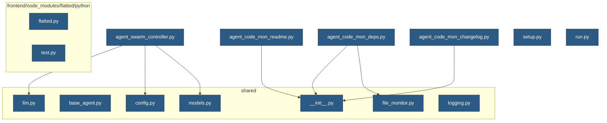

# Project Dependency Graph

## Visualization

## AI Analysis

**Assessment of Modularity**

The project's dependency structure appears to be well-organized, with an average of 0.47 dependencies per file and no circular dependencies found. This suggests that each module has a reasonable number of interconnected components, allowing for efficient reuse and minimizing coupling.

However, the presence of four files with up to three dependencies each indicates some degree of complexity. While this is not unusual in software projects, it's essential to ensure that these dependencies are not overly tight or causing unnecessary coupling.

**Potential Areas for Improvement**

While some coupling is normal and necessary, there are a few areas where improvements could be made:

1. **Dependency Management**: Consider using a dependency management tool like Maven or Gradle to help manage transitive dependencies and reduce the risk of unexpected interactions.
2. **Code Organization**: Review the codebase to ensure that related functionality is grouped together in logical modules. This can help reduce coupling between unrelated components.
3. **Avoid Deep Dependencies**: While some files have multiple dependencies, it's essential to avoid deep dependencies (i.e., a file depends on another file that itself depends on many other files). This can make the codebase harder to understand and maintain.

**Conclusion**

Overall, the project's dependency structure is well-organized, but there are opportunities for improvement. By addressing these areas, you can further enhance modularity, reduce coupling, and improve the overall maintainability of the codebase.

## Detailed Dependencies

### agent_code_mon_readme.py

Depends on:
- shared/__init__.py

### agent_code_mon_changelog.py

Depends on:
- shared/__init__.py

### agent_code_mon_deps.py

Depends on:
- shared/__init__.py
- shared/file_monitor.py

### agent_swarm_controller.py

Depends on:
- shared/llm.py
- shared/config.py
- shared/models.py

### setup.py

No dependencies

### run.py

No dependencies

### frontend/node_modules/flatted/python/flatted.py

No dependencies

### frontend/node_modules/flatted/python/test.py

No dependencies

### shared/llm.py

No dependencies

### shared/base_agent.py

No dependencies

### shared/file_monitor.py

No dependencies

### shared/models.py

No dependencies

### shared/__init__.py

No dependencies

### shared/config.py

No dependencies

### shared/logging.py

No dependencies

