# Project Dependency Graph

## Visualization

```mermaid
%%{init: {'flowchart': {'nodeSpacing': 50, 'rankSpacing': 50, 'htmlLabels': true}} }%%
flowchart TD
    %% Node styles
    classDef python fill:#2b5b84,stroke:#1a365d,color:#fff,stroke-width:2px
    classDef lua fill:#000080,stroke:#000066,color:#fff,stroke-width:2px
    classDef heavy_deps fill:#8b0000,stroke:#580000,color:#fff,stroke-width:3px
    classDef light_deps fill:#006400,stroke:#004100,color:#fff,stroke-width:1px
    classDef cluster fill:#2d2d2d,stroke:#404040,color:#fff
    subgraph level_0[Level 0]
        direction TB
        agent_code_mon_readme.py[agent_~dme]:::python
        agent_code_mon_deps.py[agent_~eps]:::python
        agent_swarm_controller.py[agent_~ler]:::python
        agent_test.py[agent_test]:::python
        agent_code_mon_deps.py[agent_~eps]:::python
        agent_code_mon_changelog.py[agent_~log]:::python
        setup.py[setup]:::light_deps
        run.py[run]:::light_deps
        frontend_node_modules_flatted_python_flatted.py[flatted]:::light_deps
        frontend_node_modules_flatted_python_test.py[test]:::light_deps
        shared_logging.py[logging]:::light_deps
    end
    subgraph level_1[Level 1]
        direction TB
        shared_base_agent.py[base_agent]:::python
        shared_llm.py[llm]:::light_deps
        shared_file_monitor.py[file_monitor]:::light_deps
        shared_models.py[models]:::light_deps
        shared___init__.py[__init__]:::light_deps
        shared_config.py[config]:::light_deps
    end
    subgraph level_2[Level 2]
        direction TB
        shared_agent_logger.py[agent_logger]:::light_deps
    end

    %% Dependencies
    agent_code_mon_changelog.py --> shared___init__.py
    agent_code_mon_deps.py --> shared___init__.py
    agent_code_mon_deps.py --> shared___init__.py
    agent_code_mon_deps.py --> shared_base_agent.py
    agent_code_mon_deps.py --> shared_base_agent.py
    agent_code_mon_deps.py --> shared_file_monitor.py
    agent_code_mon_deps.py --> shared_file_monitor.py
    agent_code_mon_readme.py --> shared___init__.py
    agent_code_mon_readme.py --> shared_base_agent.py
    agent_code_mon_readme.py --> shared_file_monitor.py
    agent_swarm_controller.py --> shared_config.py
    agent_swarm_controller.py --> shared_llm.py
    agent_swarm_controller.py --> shared_models.py
    agent_test.py --> shared___init__.py
    agent_test.py --> shared_base_agent.py
    agent_test.py --> shared_file_monitor.py
    shared_base_agent.py --> shared_agent_logger.py
```

## AI Analysis

(BEGIN AI Generated)
**Validation of Dependency Structure**

The provided dependency structure appears to be well-defined, with clear indications of which files depend on others. However, there are a few issues that need attention:

1.  `agent_code_mon_deps.py` depends on `shared/file_monitor.py`, `shared/base_agent.py`, and `shared/__init__.py`. This could create a cyclic dependency if any of these dependencies also depend on `agent_code_mon_deps.py`.
2.  `agent_swarm_controller.py` does not explicitly mention any dependencies on other modules in the project, but it does import several modules from `shared/llm.py`, `shared/config.py`, and `shared/models.py`. This might indicate that some of these imported modules have their own dependencies.

**Modularity and Coupling Analysis**

The project appears to be modular, with each module having a specific responsibility. However:

1.  Some modules (e.g., `agent_code_mon_deps.py`) seem to be tightly coupled to the `shared` package, which might limit their reusability.
2.  The presence of multiple files that import `shared/__init__.py` suggests some redundancy in the dependency structure.

**Suggestions for Improving Dependency Organization**

1.  **Extract shared modules into separate packages**: Move common dependencies and functionality into separate packages to reduce coupling between modules.
2.  **Use explicit imports instead of implicit ones**: When possible, use explicit imports (e.g., `from shared.file_monitor import monitoring_functions`) instead of importing everything (`from shared import *`).
3.  **Consider using a dependency resolution mechanism**: If the project uses multiple tools or frameworks for dependency management, consider implementing a unified dependency resolution mechanism to simplify the overall structure.
4.  **Refactor cyclic dependencies**: Address potential cyclic dependencies by reorganizing the module structure and importing relationships.

**Potential Circular Dependencies or Problematic Patterns**

The most obvious issue is the cyclic dependency between `agent_code_mon_deps.py` and other modules that depend on it. To resolve this, consider one of the following approaches:

*   Refactor `agent_code_mon_deps.py` to not depend on any other modules.
*   Extract dependencies from `agent_code_mon_deps.py` into separate files or packages.
*   Reorganize the import relationships between modules to avoid cyclic dependencies.

By addressing these issues and suggestions, you can improve the overall modularity, coupling, and maintainability of the project.
(END AI Generated)

## Detailed Dependencies

### agent_code_mon_readme.py

Depends on:
- shared/file_monitor.py
- shared/base_agent.py
- shared/__init__.py

### agent_code_mon_changelog.py

Depends on:
- shared/__init__.py

### agent_code_mon_deps.py

Depends on:
- shared/file_monitor.py
- shared/base_agent.py
- shared/__init__.py

### agent_swarm_controller.py

Depends on:
- shared/llm.py
- shared/config.py
- shared/models.py

### setup.py

No dependencies

### agent_test.py

Depends on:
- shared/file_monitor.py
- shared/base_agent.py
- shared/__init__.py

### run.py

No dependencies

### frontend/node_modules/flatted/python/flatted.py

No dependencies

### frontend/node_modules/flatted/python/test.py

No dependencies

### shared/llm.py

No dependencies

### shared/base_agent.py

Depends on:
- shared/agent_logger.py

### shared/file_monitor.py

No dependencies

### shared/models.py

No dependencies

### shared/__init__.py

No dependencies

### shared/config.py

No dependencies

### shared/agent_logger.py

No dependencies

### shared/logging.py

No dependencies

### agent_code_mon_deps.py

Depends on:
- shared/file_monitor.py
- shared/base_agent.py
- shared/__init__.py
