# Project Dependency Graph

## Visualization

```mermaid
graph TD
    %% Node styles
    classDef python fill:#2b5b84,stroke:#1a365d,color:#fff,stroke-width:2px;
    classDef lua fill:#000080,stroke:#000066,color:#fff,stroke-width:2px;
    classDef heavy_deps fill:#8b0000,stroke:#580000,color:#fff,stroke-width:3px;
    classDef light_deps fill:#006400,stroke:#004100,color:#fff,stroke-width:1px;
    classDef cluster fill:#2d2d2d,stroke:#404040,color:#fff;

    %% Link styles
    linkStyle default stroke:#666,stroke-width:1px;
    subgraph cluster_0[Cluster 1]
    direction TB
        agent_code_mon_readme.py[agent_~dme]:::python
        agent_code_mon_deps.py[agent_~eps]:::python
        agent_test.py[agent_test]:::python
        shared_base_agent.py[base_agent]:::python
        agent_code_mon_changelog.py[agent_~log]:::python
        shared_file_monitor.py[file_monitor]:::light_deps
        shared_agent_logger.py[agent_logger]:::light_deps
        shared___init__.py[__init__]:::light_deps
    end
    style cluster_0 fill:#2d2d2d,stroke:#404040,color:#fff
    subgraph cluster_1[Cluster 2]
    direction TB
        agent_swarm_controller.py[agent_~ler]:::python
        shared_config.py[config]:::light_deps
        shared_llm.py[llm]:::light_deps
        shared_models.py[models]:::light_deps
    end
    style cluster_1 fill:#2d2d2d,stroke:#404040,color:#fff
    subgraph cluster_2[Cluster 3]
    direction TB
        setup.py[setup]:::light_deps
    end
    style cluster_2 fill:#2d2d2d,stroke:#404040,color:#fff
    subgraph cluster_3[Cluster 4]
    direction TB
        run.py[run]:::light_deps
    end
    style cluster_3 fill:#2d2d2d,stroke:#404040,color:#fff
    subgraph cluster_4[Cluster 5]
    direction TB
        frontend_node_modules_flatted_python_flatted.py[flatted]:::light_deps
    end
    style cluster_4 fill:#2d2d2d,stroke:#404040,color:#fff
    subgraph cluster_5[Cluster 6]
    direction TB
        frontend_node_modules_flatted_python_test.py[test]:::light_deps
    end
    style cluster_5 fill:#2d2d2d,stroke:#404040,color:#fff
    subgraph cluster_6[Cluster 7]
    direction TB
        shared_logging.py[logging]:::light_deps
    end
    style cluster_6 fill:#2d2d2d,stroke:#404040,color:#fff

    %% Dependencies
    agent_code_mon_readme.py ==> shared___init__.py
    agent_code_mon_readme.py ==> shared_base_agent.py
    agent_code_mon_readme.py ==> shared_file_monitor.py
    agent_code_mon_changelog.py ==> shared___init__.py
    agent_code_mon_deps.py ==> shared___init__.py
    agent_code_mon_deps.py ==> shared_base_agent.py
    agent_code_mon_deps.py ==> shared_file_monitor.py
    agent_swarm_controller.py ==> shared_config.py
    agent_swarm_controller.py ==> shared_llm.py
    agent_swarm_controller.py ==> shared_models.py
    agent_test.py ==> shared___init__.py
    agent_test.py ==> shared_base_agent.py
    agent_test.py ==> shared_file_monitor.py
    shared_base_agent.py ==> shared_agent_logger.py
```

## Dependencies

### agent_code_mon_readme.py

Depends on:
- shared/__init__.py
- shared/base_agent.py
- shared/file_monitor.py

### agent_code_mon_changelog.py

Depends on:
- shared/__init__.py

### agent_code_mon_deps.py

Depends on:
- shared/base_agent.py
- shared/file_monitor.py
- shared/__init__.py

### agent_swarm_controller.py

Depends on:
- shared/llm.py
- shared/config.py
- shared/models.py

### setup.py

No dependencies

### agent_test.py

Depends on:
- shared/base_agent.py
- shared/file_monitor.py
- shared/__init__.py

### run.py

No dependencies

### frontend/node_modules/flatted/python/flatted.py

No dependencies

### frontend/node_modules/flatted/python/test.py

No dependencies

### shared/llm.py

No dependencies

### shared/base_agent.py

Depends on:
- shared/agent_logger.py

### shared/file_monitor.py

No dependencies

### shared/models.py

No dependencies

### shared/__init__.py

No dependencies

### shared/config.py

No dependencies

### shared/agent_logger.py

No dependencies

### shared/logging.py

No dependencies
