# Project Dependency Graph

## Visualization

```mermaid
%%{init: {'flowchart': {'nodeSpacing': 50, 'rankSpacing': 50, 'htmlLabels': true}} }%%
flowchart TD
    %% Node styles
    classDef python fill:#2b5b84,stroke:#1a365d,color:#fff,stroke-width:2px
    classDef lua fill:#000080,stroke:#000066,color:#fff,stroke-width:2px
    classDef heavy_deps fill:#8b0000,stroke:#580000,color:#fff,stroke-width:3px
    classDef light_deps fill:#006400,stroke:#004100,color:#fff,stroke-width:1px
    classDef cluster fill:#2d2d2d,stroke:#404040,color:#fff
    subgraph level_0[Level 0]
        direction TB
        agent_code_mon_readme.py[agent_~dme]:::python
        agent_code_mon_deps.py[agent_~eps]:::python
        agent_swarm_controller.py[agent_~ler]:::python
        agent_test.py[agent_test]:::python
        agent_code_mon_changelog.py[agent_~log]:::python
        setup.py[setup]:::light_deps
        run.py[run]:::light_deps
        frontend_node_modules_flatted_python_flatted.py[flatted]:::light_deps
        frontend_node_modules_flatted_python_test.py[test]:::light_deps
        shared_logging.py[logging]:::light_deps
    end
    subgraph level_1[Level 1]
        direction TB
        shared_base_agent.py[base_agent]:::python
        shared_llm.py[llm]:::light_deps
        shared_file_monitor.py[file_monitor]:::light_deps
        shared_models.py[models]:::light_deps
        shared___init__.py[__init__]:::light_deps
        shared_config.py[config]:::light_deps
    end
    subgraph level_2[Level 2]
        direction TB
        shared_agent_logger.py[agent_logger]:::light_deps
    end

    %% Dependencies
    agent_code_mon_changelog.py --> shared___init__.py
    agent_code_mon_deps.py --> shared___init__.py
    agent_code_mon_deps.py --> shared_base_agent.py
    agent_code_mon_deps.py --> shared_file_monitor.py
    agent_code_mon_readme.py --> shared___init__.py
    agent_code_mon_readme.py --> shared_base_agent.py
    agent_code_mon_readme.py --> shared_file_monitor.py
    agent_swarm_controller.py --> shared_config.py
    agent_swarm_controller.py --> shared_llm.py
    agent_swarm_controller.py --> shared_models.py
    agent_test.py --> shared___init__.py
    agent_test.py --> shared_base_agent.py
    agent_test.py --> shared_file_monitor.py
    shared_base_agent.py --> shared_agent_logger.py
```

## AI Analysis

(BEGIN AI Generated)
**Validation of Dependency Structure**

The provided dependency structure appears to be generally valid, with each module depending on its required files. However, there are a few issues:

*   `shared/agent_logger.py` is not mentioned as a dependency in any other module, which might indicate that it's only used within the same package or by other internal modules.
*   The file `flatted.py` and `test.py` from `frontend/node_modules/flatted/python` are listed without their respective dependencies. It would be better to include them in the dependency structure for clarity.

**Analysis of Modularity and Coupling**

The project's modularity is generally good, with each module serving a specific purpose:

*   The `agent_code_mon_*.py` files seem to focus on agent-related functionality.
*   The `shared/llm.py`, `shared/models.py`, and `shared/config.py` files appear to handle common data structures and configuration.
*   The `setup.py` file seems to be a standard setup script.

However, some potential coupling issues are observed:

*   Some modules (e.g., `agent_code_mon_readme.py`) depend on multiple shared modules (`shared/file_monitor.py`, `shared/base_agent.py`). While this is not necessarily an issue in itself, it might make maintenance more difficult if one of the dependencies changes.
*   The `agent_swarm_controller.py` file depends on both `llm.py` and `models.py`. This could indicate a tight coupling between these modules.

**Suggestions for Improving Dependency Organization**

To improve dependency organization:

1.  Consider moving `shared/agent_logger.py` to a separate package or module, depending on its internal usage.
2.  Add the dependencies of `flatted.py` and `test.py` from `frontend/node_modules/flatted/python`.
3.  Refactor modules with multiple shared dependencies into smaller, more focused components.
4.  Consider using a more explicit dependency management system (e.g., pip-compile) to handle transitive dependencies.

**Potential Circular Dependencies or Problematic Patterns**

Based on the provided structure, there don't appear to be any circular dependencies that would cause issues during compilation or runtime.

However, some patterns are worth noting:

*   Multiple modules depending on a single shared module (e.g., `shared/file_monitor.py`) might lead to tight coupling and make maintenance more difficult.
*   The use of a `__init__.py` file in the `shared` package indicates that it's used as a namespace package. This is perfectly fine, but it might be worth clarifying the purpose of this package in comments or documentation.

Overall, the project's dependency structure seems generally well-organized, and with some minor adjustments, it can become even more maintainable and scalable.
(END AI Generated)

## Detailed Dependencies

### agent_code_mon_readme.py

Depends on:
- shared/file_monitor.py
- shared/base_agent.py
- shared/__init__.py

### agent_code_mon_changelog.py

Depends on:
- shared/__init__.py

### agent_code_mon_deps.py

Depends on:
- shared/file_monitor.py
- shared/base_agent.py
- shared/__init__.py

### agent_swarm_controller.py

Depends on:
- shared/llm.py
- shared/config.py
- shared/models.py

### setup.py

No dependencies

### agent_test.py

Depends on:
- shared/file_monitor.py
- shared/base_agent.py
- shared/__init__.py

### run.py

No dependencies

### frontend/node_modules/flatted/python/flatted.py

No dependencies

### frontend/node_modules/flatted/python/test.py

No dependencies

### shared/llm.py

No dependencies

### shared/base_agent.py

Depends on:
- shared/agent_logger.py

### shared/file_monitor.py

No dependencies

### shared/models.py

No dependencies

### shared/__init__.py

No dependencies

### shared/config.py

No dependencies

### shared/agent_logger.py

No dependencies

### shared/logging.py

No dependencies
