# Project Dependency Graph

## AI Analysis

**Modularity Assessment:**
The project appears to be moderately modular, with a good balance between dependencies and self-contained files. However, the presence of highly coupled files (e.g., `agent_code_mon_deps.py` and `shared/__init__.py`) indicates some areas for improvement.

**Potential Issues/Anti-Patterns:**

1. **Highly Coupled Files:** The high number of dependencies in these files makes them brittle and prone to breaking when changes are made elsewhere in the project.
2. **Monolithic Dependencies:** Some files (`agent_swarm_controller.py`) have an excessive number of dependencies, which can lead to tight coupling between components.

**Recommendations for Improvement:**

1. Refactor highly coupled files to reduce their dependency count (e.g., extract common functionality into separate modules).
2. Consider using a more modular design for `shared/__init__.py`, breaking out its dependencies into separate files.
3. Encourage a more balanced distribution of dependencies across the project, aiming for an average of 1-2 dependencies per file.
4. Regularly review and refactor code to prevent tight coupling and maintain a healthy dependency structure.

## Visualization

```mermaid
graph TD
    subgraph frontend_node_modules_flatted_python[frontend/node_modules/flatted/python]
        frontend_node_modules_flatted_python_flatted[flatted.py]
        frontend_node_modules_flatted_python_test[test.py]
    end
    subgraph shared[shared]
        shared_llm[llm.py]
        shared_base_agent[base_agent.py]
        shared_file_monitor[file_monitor.py]
        shared_models[models.py]
        shared___init__[__init__.py]
        shared_config[config.py]
        shared_logging[logging.py]
    end
    agent_code_mon_readme[agent_code_mon_readme.py]
    agent_code_mon_changelog[agent_code_mon_changelog.py]
    agent_code_mon_deps[agent_code_mon_deps.py]
    agent_swarm_controller[agent_swarm_controller.py]
    agent_code_mon_readme --> shared_llm
    agent_code_mon_readme --> shared_logging
    agent_code_mon_changelog --> shared_llm
    agent_code_mon_changelog --> shared_logging
    agent_code_mon_deps --> shared_file_monitor
    agent_code_mon_deps --> shared_llm
    agent_code_mon_deps --> shared_logging
    agent_swarm_controller --> shared_config
    agent_swarm_controller --> shared_llm
    agent_swarm_controller --> shared_models
    frontend_node_modules_flatted_python_test --> frontend_node_modules_flatted_python_flatted
    shared_llm --> shared_config
    shared_file_monitor --> shared_config
    shared_file_monitor --> shared_logging
    shared___init__ --> shared_config
    shared___init__ --> shared_file_monitor
    shared___init__ --> shared_llm
    shared___init__ --> shared_logging

```

## Detailed Dependencies

### agent_code_mon_readme.py

Depends on:
- shared/llm.py
- shared/logging.py

### agent_code_mon_changelog.py

Depends on:
- shared/llm.py
- shared/logging.py

### agent_code_mon_deps.py

Depends on:
- shared/file_monitor.py
- shared/llm.py
- shared/logging.py

### agent_swarm_controller.py

Depends on:
- shared/config.py
- shared/llm.py
- shared/models.py

### frontend/node_modules/flatted/python/flatted.py

No dependencies

### frontend/node_modules/flatted/python/test.py

Depends on:
- frontend/node_modules/flatted/python/flatted.py

### shared/llm.py

Depends on:
- shared/config.py

### shared/base_agent.py

No dependencies

### shared/file_monitor.py

Depends on:
- shared/config.py
- shared/logging.py

### shared/models.py

No dependencies

### shared/__init__.py

Depends on:
- shared/config.py
- shared/file_monitor.py
- shared/llm.py
- shared/logging.py

### shared/config.py

No dependencies

### shared/logging.py

No dependencies

