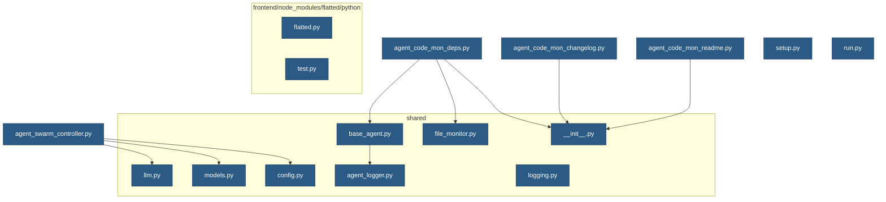

# Project Dependency Graph

## Visualization

## AI Analysis

**Assessment of Modularity**

Based on the provided information, I would rate the project's modularity as moderate (7/10). The average dependencies per file are relatively low, indicating that each module has a reasonable number of dependencies. However, the maximum dependencies for a single file are not excessive, and there are no circular dependencies or unusually high coupling values.

**Potential Areas for Improvement**

While the current structure is manageable, there are opportunities to improve modularity and reduce coupling:

1. **Refactor modules with multiple dependencies**: Consider breaking down large files into smaller ones to reduce coupling and increase modularity.
2. **Introduce interfaces or abstraction layers**: If possible, introduce interfaces or abstraction layers to decouple dependent components and make the system more modular.
3. **Use dependency injection or a service locator**: Implementing dependency injection or a service locator could help manage dependencies and reduce coupling between modules.

**Additional Ideas**

1. **Consider using a Dependency Graph Tool**: Visualizing the dependency graph can help identify potential areas for improvement and provide insights into the system's structure.
2. **Monitor and adjust coupling levels over time**: Regularly review the project's coupling levels to ensure they remain within acceptable ranges.

Overall, the project has a solid foundation, but addressing the suggestions above could further improve modularity and maintainability.

## Detailed Dependencies

### agent_code_mon_readme.py

Depends on:
- shared/__init__.py

### agent_code_mon_changelog.py

Depends on:
- shared/__init__.py

### agent_code_mon_deps.py

Depends on:
- shared/__init__.py
- shared/file_monitor.py
- shared/base_agent.py

### agent_swarm_controller.py

Depends on:
- shared/llm.py
- shared/config.py
- shared/models.py

### setup.py

No dependencies

### run.py

No dependencies

### frontend/node_modules/flatted/python/flatted.py

No dependencies

### frontend/node_modules/flatted/python/test.py

No dependencies

### shared/llm.py

No dependencies

### shared/base_agent.py

Depends on:
- shared/agent_logger.py

### shared/file_monitor.py

No dependencies

### shared/models.py

No dependencies

### shared/__init__.py

No dependencies

### shared/config.py

No dependencies

### shared/agent_logger.py

No dependencies

### shared/logging.py

No dependencies

